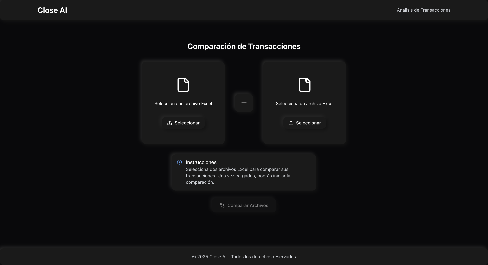
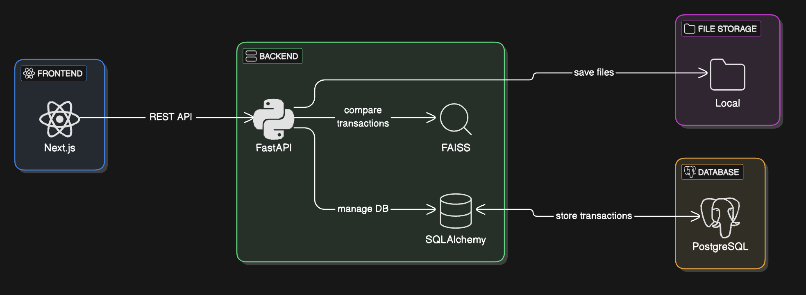
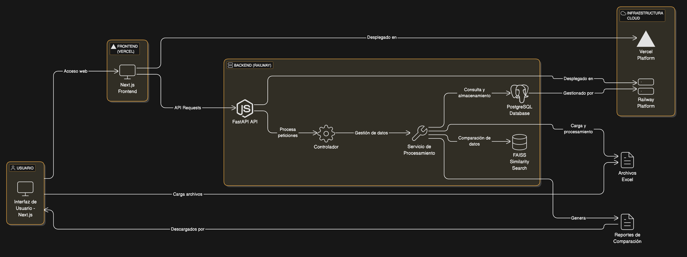
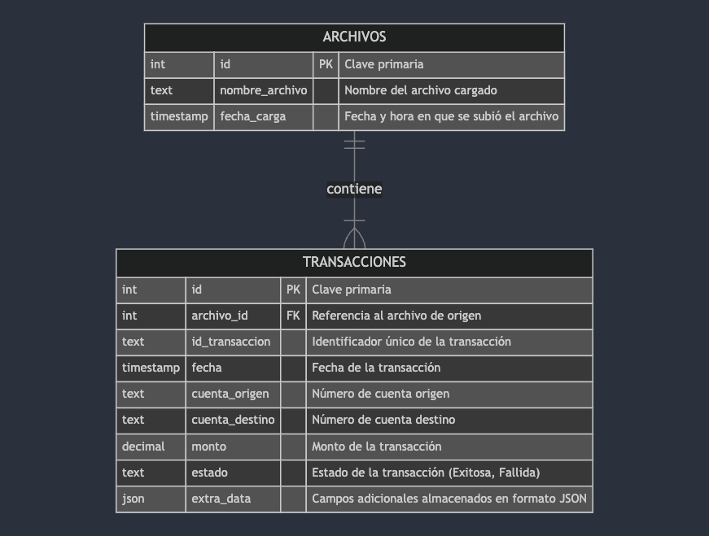
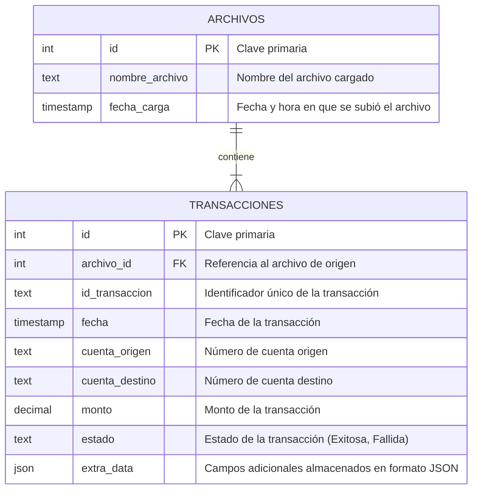

## Índice

0. [Ficha del proyecto](#0-ficha-del-proyecto)
1. [Descripción general del producto](#1-descripción-general-del-producto)
2. [Arquitectura del sistema](#2-arquitectura-del-sistema)
3. [Modelo de datos](#3-modelo-de-datos)
4. [Especificación de la API](#4-especificación-de-la-api)
5. [Historias de usuario](#5-historias-de-usuario)
6. [Tickets de trabajo](#6-tickets-de-trabajo)
7. [Pull requests](#7-pull-requests)

---

## 0. Ficha del proyecto

### **0.1. Tu nombre completo:**

Jorge Luis Sánchez Ocampo

### **0.2. Nombre del proyecto:**

Close AI

### **0.3. Descripción breve del proyecto:**

Close AI es un sistema basado en inteligencia artificial diseñado para analizar y comparar transacciones bancarias provenientes de archivos Excel. Su objetivo es identificar coincidencias entre registros, detectar discrepancias en montos y estados de transacción, y facilitar la revisión manual de posibles errores. Utiliza técnicas avanzadas de procesamiento de datos con Pandas, búsqueda de similitud con FAISS y generación de embeddings con SentenceTransformers. Close AI está diseñado para ser eficiente, escalable y fácilmente integrable mediante una API, permitiendo su uso en aplicaciones financieras y auditorías automatizadas.

### **0.4. URL del proyecto:**

https://closeai-blush.vercel.app/

### 0.5. URL o archivo comprimido del repositorio

https://github.com/IamJorx/close-ai

---

## 1. Descripción general del producto

Close AI es un sistema basado en inteligencia artificial diseñado para analizar y comparar transacciones bancarias provenientes de archivos Excel. Su objetivo es identificar coincidencias entre registros, detectar discrepancias en montos y estados de transacción, y facilitar la revisión manual de posibles errores.

El sistema utiliza técnicas avanzadas de procesamiento de datos con Pandas, búsqueda de similitud con FAISS, generación de embeddings con SentenceTransformers y una base de datos en PostgreSQL para almacenar y gestionar las transacciones de manera eficiente. Está compuesto por un backend desarrollado en FastAPI y un frontend en Next.js, ofreciendo una interfaz intuitiva para la carga de archivos.

### **1.1. Objetivo:**

Close AI está diseñado para ayudar a instituciones financieras, contadores, auditores y equipos de compliance en la detección de inconsistencias en transacciones bancarias. Su principal propósito es:

- Automatizar la comparación de registros financieros para reducir errores manuales.
- Identificar discrepancias entre archivos de diferentes fuentes (por ejemplo, conciliaciones bancarias).
- Optimizar el tiempo de auditoría proporcionando reportes claros y organizados.
- Ofrecer una solución escalable que pueda manejar grandes volúmenes de datos sin degradación del rendimiento.

### **1.2. Características y funcionalidades principales:**

Comparación de transacciones

- Identificación de coincidencias exactas y transacciones con discrepancias.
- Tolerancia a variaciones menores en montos y fechas.
- Detección de estados inconsistentes (ej. "Exitosa" vs "Fallida").

Análisis y Reportes

- Visualización de resultados en una interfaz intuitiva.
- Descarga de reportes detallados en formatos Excel/CSV.
- Búsqueda y filtrado avanzado de transacciones.

Gestión de Archivos -

- Carga de dos archivos Excel para comparación.
- Manejo eficiente de archivos grandes mediante procesamiento optimizado.

Integración y API -

- API en FastAPI para automatización de procesos.
- Soporte para integración con sistemas externos.
- Arquitectura modular para futuras expansiones.

Seguridad

- Eliminar los datos de la base de datos después de la comparación.
- Manejo seguro de archivos y eliminación automática después del análisis.

### **1.3. Diseño y experiencia de usuario:**

Flujo de usuario esperado:

1. Subir archivos: Los usuarios pueden cargar dos archivos Excel para comparar.
2. Procesamiento automático: Close AI analiza las transacciones y genera coincidencias y discrepancias.
3. Visualización de resultados: Se muestra una tabla con transacciones coincidentes, diferencias y registros a revisar manualmente.
4. Descarga de reportes: Los usuarios pueden exportar los resultados en Excel o CSV.



### **1.4. Instrucciones de instalación:**

#### Requisitos previos

- [Docker](https://www.docker.com/products/docker-desktop/) y Docker Compose
- [Node.js](https://nodejs.org/) (v18 o superior)
- [Python](https://www.python.org/) 3.11 o superior (opcional, solo si no se usa Docker)
- [Git](https://git-scm.com/)

#### Clonar el repositorio

```bash
git clone https://github.com/IamJorx/close-ai.git
cd close-ai
```

#### Configuración del Backend

1. **Usando Docker (recomendado)**:

   Navega a la carpeta del backend:

   ```bash
   cd closeai-backend
   ```

   Crea un archivo `.env` basado en el ejemplo:

   ```bash
   cp .env.example .env
   ```

   Edita el archivo `.env` para configurar las variables de entorno:

   ```
   # PostgreSQL
   POSTGRES_SERVER=postgres
   POSTGRES_USER=postgres
   POSTGRES_PASSWORD=postgres
   POSTGRES_DB=closeai
   POSTGRES_PORT=5432

   # General
   SECRET_KEY=your-secret-key
   BACKEND_CORS_ORIGINS=["http://localhost:3000"]
   ```

   Inicia los servicios con Docker Compose:

   ```bash
   docker-compose up -d
   ```

   Esto iniciará:

   - El servidor API en http://localhost:8000
   - PostgreSQL en el puerto 5432
   - pgAdmin en http://localhost:5050 (opcional, para gestionar la base de datos)

2. **Instalación manual (alternativa)**:

   Navega a la carpeta del backend:

   ```bash
   cd closeai-backend
   ```

   Crea y activa un entorno virtual:

   ```bash
   python -m venv venv
   source venv/bin/activate  # En Windows: venv\Scripts\activate
   ```

   Instala las dependencias:

   ```bash
   pip install -r requirements.txt
   ```

   Configura las variables de entorno (similar al paso anterior).

   Ejecuta las migraciones de la base de datos:

   ```bash
   alembic upgrade head
   ```

   Inicia el servidor:

   ```bash
   uvicorn main:app --reload
   ```

#### Configuración del Frontend

1. Navega a la carpeta del frontend:

   ```bash
   cd closeai-frontend
   ```

2. Instala las dependencias:

   ```bash
   npm install
   ```

3. Crea un archivo `.env.local` con la configuración:

   ```
   NEXT_PUBLIC_API_URL=http://localhost:8000/api/v1
   ```

4. Inicia el servidor de desarrollo:

   ```bash
   npm run dev
   ```

   El frontend estará disponible en http://localhost:3000

#### Verificación de la instalación

1. Accede al frontend en http://localhost:3000
2. Verifica que puedes cargar archivos Excel y realizar comparaciones
3. La documentación de la API está disponible en http://localhost:8000/docs

#### Solución de problemas comunes

- **Error de conexión a la base de datos**: Verifica que PostgreSQL esté en ejecución y las credenciales en el archivo `.env` sean correctas.
- **Error al cargar archivos**: Asegúrate de que los archivos Excel tengan el formato esperado (consulta la documentación).
- **Problemas con Docker**: Verifica que Docker Desktop esté en ejecución y los puertos no estén siendo utilizados por otras aplicaciones.

Para más información, consulta los archivos `GUIA_EJECUCION.md` y `EJEMPLOS_CURL.md` en la carpeta del backend.

---

## 2. Arquitectura del Sistema

### **2.1. Diagrama de arquitectura:**



[Link - Diagrama de arquitectura](https://app.eraser.io/workspace/nQyQCyIMGDgN8R2yeEZD?origin=share)

### **2.2. Descripción de componentes principales:**

### **2.2. Descripción de Componentes Principales**

A continuación, se describen los componentes más importantes del sistema **Close AI**, junto con la tecnología utilizada en cada uno:

#### **Frontend (Next.js)**

- **Tecnología:** Next.js, TypeScript, TailwindCSS.
- **Descripción:** Interfaz gráfica donde el usuario carga archivos Excel y visualiza los resultados de comparación. Se comunica con el backend mediante API REST.
- **Interfaces principales:**

  ```typescript
  // Interfaz para los datos del archivo
  export interface ArchivoData {
  	id: number;
  	nombre_archivo: string;
  	fecha_carga: string;
  }

  // Interfaz para la respuesta de carga de archivo
  export interface ArchivoResponse {
  	archivo_id: ArchivoData;
  }

  // Interfaz para la respuesta de archivo con transacciones
  export interface ArchivoWithTransaccionesResponse extends ArchivoData {
  	transacciones: TransaccionResponse[];
  }
  ```

#### **Backend (FastAPI)**

- **Tecnología:** FastAPI, Python, Uvicorn.
- **Descripción:** Procesa las solicitudes del frontend, maneja la carga y comparación de transacciones, y expone los resultados a través de una API.

#### **Servicio de Procesamiento**

- **Tecnología:** Pandas, FAISS, SentenceTransformers.
- **Descripción:** Analiza y compara las transacciones de los archivos Excel. Normaliza datos, detecta discrepancias y genera reportes.

#### **Almacenamiento de Archivos (Temporal)**

- **Tecnología:** Sistema de archivos local.
- **Descripción:** Los archivos Excel se procesan en memoria sin ser almacenados. Los resultados se generan y descargan directamente desde la interfaz de usuario.

#### **Base de Datos (PostgreSQL)**

- **Tecnología:** PostgreSQL, SQLAlchemy (asyncpg).
- **Descripción:** Almacena transacciones procesadas, facilita la comparación de datos y permite realizar consultas eficientes.

#### **API Gateway**

- **Tecnología:** FastAPI.
- **Descripción:** Maneja las solicitudes API desde el frontend y las distribuye a los controladores del backend.

#### **Seguridad**

- **Tecnología:** OAuth2, JWT, CORS.
- **Descripción:** Gestiona la autenticación y autorización de usuarios para proteger el acceso a los datos.

### **2.3. Descripción de alto nivel del proyecto y estructura de ficheros**

### **2.3. Descripción de Alto Nivel del Proyecto y Estructura de Ficheros**

Close AI sigue una **arquitectura modular basada en capas**, donde el **frontend (Next.js)** y el **backend (FastAPI)** están separados, facilitando la escalabilidad y el mantenimiento. El backend sigue el patrón **MVC (Model-View-Controller)** adaptado para API REST, mientras que el frontend gestiona la UI y las solicitudes API.

### **Estructura de Ficheros**

```plaintext
close-ai/
│── backend/                # Código fuente del backend (FastAPI)
│   ├── app/                # Lógica principal del backend
│   │   ├── api/            # Endpoints y controladores de la API
│   │   ├── models/         # Definición de modelos SQLAlchemy
│   │   ├── services/       # Lógica de negocio y procesamiento de transacciones
│   │   ├── db/             # Configuración de la base de datos y migraciones
│   │   ├── core/           # Configuraciones generales (seguridad, autenticación, etc.)
│   │   ├── schemas/        # Esquemas Pydantic para validación de datos
│   │   ├── utils/          # Funciones auxiliares y herramientas
│   │   ├── tests/          # Pruebas automatizadas
│   │   ├── main.py         # Punto de entrada del backend
│   │   ├── requirements.txt# Dependencias del backend
│   │   ├── alembic/        # Migraciones de base de datos con Alembic
│
│── frontend/               # Código fuente del frontend (Next.js)
│   ├── src/                # Lógica principal del frontend
│   │   ├── components/     # Componentes reutilizables de React
│   │   ├── pages/          # Rutas y vistas principales
│   │   ├── services/       # Funciones para comunicación con la API
│   │   ├── hooks/          # Hooks personalizados de React
│   │   ├── styles/         # Estilos globales y de componentes
│   ├── public/             # Recursos estáticos (imágenes, íconos, etc.)
│   ├── package.json        # Dependencias del frontend
│   ├── next.config.js      # Configuración de Next.js
│
│── docs/                   # Documentación del proyecto
│── .env.example            # Variables de entorno de ejemplo
│── docker-compose.yml      # Configuración de contenedores Docker
│── README.md               # Documentación general del proyecto
```

---

### **Explicación de la Arquitectura**

1. **Backend desacoplado del frontend** → Facilita el mantenimiento y escalabilidad.
2. **Uso de capas (MVC adaptado a API REST)** → Separa la lógica de negocio, los modelos y los controladores.
3. **Base de datos gestionada con SQLAlchemy y PostgreSQL** → Permite consultas eficientes y persistencia estructurada.
4. **Frontend modular con Next.js** → Organizado en **componentes, páginas y servicios** para una mejor reutilización.
5. **Integración con FastAPI y PostgreSQL** → Conexión eficiente para procesamiento y almacenamiento de transacciones.

### **2.4. Infraestructura y despliegue**

Close AI utiliza una infraestructura modular y escalable basada en **contenedores Docker** y servicios en la nube para facilitar su despliegue y mantenimiento. A continuación, se detalla la infraestructura del proyecto y el proceso de despliegue.



[Link - Infraestructura y despliegue](https://app.eraser.io/workspace/KUo7LHd3I7iIrHMfQgNh?origin=share)

#### **Componentes de Infraestructura**

| Componente                | Tecnología                                   | Función                                                         |
| ------------------------- | -------------------------------------------- | --------------------------------------------------------------- |
| **Frontend**              | Next.js, TypeScript                          | Interfaz de usuario para carga y visualización de datos.        |
| **Backend**               | FastAPI, Python                              | Procesa archivos y compara transacciones.                       |
| **Base de Datos**         | PostgreSQL                                   | Almacena transacciones y facilita consultas eficientes.         |
| **Búsqueda de Similitud** | FAISS, SentenceTransformers                  | Permite encontrar transacciones similares con embeddings.       |
| **Contenedores**          | Docker, Docker Compose                       | Facilita la replicación del entorno de desarrollo y producción. |
| **Proxy Reverso**         | Nginx                                        | Gestiona el tráfico de red y protege la API.                    |
| **Despliegue en la Nube** | AWS/GCP (Opcional) - vercel para el frontend | Permite ejecutar la aplicación en servidores escalables.        |

### Proceso de despliegue

#### Despliegue del frontend en Vercel

El frontend se despliega automáticamente en Vercel con cada push a la rama `main`.

```sh
git push origin main
```

Vercel detectará los cambios y desplegará la nueva versión en `https://closeai.vercel.app/`.

---

#### Despliegue del backend con Docker

```sh
docker-compose up -d --build
```

---

#### Configuración del servidor con Nginx

```sh
sudo systemctl restart nginx
```

### **2.5. Seguridad**

Close AI implementa diversas prácticas de seguridad para proteger los datos y garantizar la integridad del sistema. A continuación, se describen las principales medidas adoptadas:

---

## Protección contra ataques comunes

- **CORS (Cross-Origin Resource Sharing):** Se configuran reglas estrictas para controlar qué dominios pueden acceder a la API.
- **Rate Limiting:** Se establece un límite de solicitudes por minuto para prevenir ataques de fuerza bruta.
- **Protección contra SQL Injection:** Uso de **SQLAlchemy ORM** para consultas parametrizadas en la base de datos.
- **Protección contra XSS y CSRF:** Sanitización de entradas y validación de datos en el frontend y backend.

---

## Seguridad en la base de datos

- **Control de Acceso y Autenticación:** Crear un usuario de PostgreSQL con permisos limitados solo a las operaciones necesarias (LECTURA/ESCRITURA).
- **Principio de privilegios mínimos:** Los usuarios de la base de datos tienen permisos restringidos según sus necesidades.
- **Prevención de Inyecciones SQL:** Uso de consultas parametrizadas en SQLAlchemy.

---

## Seguridad en la infraestructura

- **Firewall y control de acceso:** Se configuran reglas de firewall para restringir accesos no autorizados al servidor.
- **Proxy reverso con Nginx:** Actúa como una capa de seguridad adicional para proteger el backend.
- **Despliegue seguro en Vercel y servidores cloud:** Uso de HTTPS y certificados SSL para cifrar la comunicación.

---

## Beneficios de estas prácticas

- Reducción del riesgo de ataques cibernéticos.
- Mayor seguridad en la comunicación entre el frontend y el backend.
- Protección de datos sensibles mediante encriptación y validaciones estrictas.

Estas medidas garantizan un sistema seguro y confiable para el procesamiento de transacciones en Close AI.

### **2.6. Tests**

Close AI implementa un conjunto completo de pruebas para garantizar la calidad y el correcto funcionamiento del sistema. Las pruebas están organizadas en diferentes categorías según su propósito y alcance.

#### Pruebas unitarias

Las pruebas unitarias verifican el funcionamiento correcto de componentes individuales del sistema:

- **Procesamiento de datos:** Verifican que las funciones de normalización y limpieza de datos en Pandas funcionan correctamente.
- **Comparación de transacciones:** Aseguran que el motor de comparación detecta correctamente coincidencias y discrepancias.
- **Conversión de formatos:** Validan que los montos y fechas se convierten al formato estándar esperado.

Los tests unitarios incluyen:

- `test_archivo_service.py`: Prueba las funciones de procesamiento de archivos Excel.
- `test_comparacion_service.py`: Verifica la lógica de comparación entre transacciones.
- `test_formato_service.py`: Comprueba la normalización de formatos de fecha y montos.

Para ejecutar las pruebas unitarias:

```bash
# Navegar al directorio del backend
cd closeai-backend

# Ejecutar todas las pruebas unitarias
pytest tests/unit/ -v

# Ejecutar pruebas específicas
pytest tests/unit/test_archivo_service.py -v
pytest tests/unit/test_comparacion_service.py -v
pytest tests/unit/test_formato_service.py -v
```

#### Pruebas de integración

Las pruebas de integración verifican la interacción entre diferentes componentes del sistema:

- **Conexión con PostgreSQL:** Comprueban que las transacciones se almacenan y consultan correctamente en la base de datos.
- **API de procesamiento:** Validan que los endpoints del backend reciben archivos, procesan los datos y devuelven resultados esperados.
- **Flujo completo:** Simulan la carga de archivos y verifican que los resultados son correctos.

Los tests de integración incluyen:

- `test_archivo_upload.py`: Prueba el endpoint de carga de archivos y su procesamiento.
- `test_api.py`: Verifica los endpoints básicos de la API, incluyendo health check y documentación.

Para ejecutar las pruebas de integración:

```bash
# Ejecutar todas las pruebas de integración
pytest tests/integration/ -v

# Ejecutar pruebas específicas
pytest tests/integration/test_archivo_upload.py -v
pytest tests/integration/test_api.py -v
```

#### Ejecución de todas las pruebas

Para ejecutar todas las pruebas del sistema:

```bash
# Ejecutar todas las pruebas
pytest

# Ejecutar con cobertura de código
pytest --cov=app tests/
```

#### Configuración de pruebas

Las pruebas utilizan una base de datos PostgreSQL de prueba separada para evitar afectar los datos de producción. La configuración se encuentra en el archivo `conftest.py`.

Para configurar la base de datos de prueba:

1. Crear una base de datos llamada `test_closeai` en PostgreSQL
2. Asegurarse de que las credenciales en `conftest.py` son correctas
3. Las tablas se crean y eliminan automáticamente durante las pruebas

---

## 3. Modelo de Datos

El modelo de datos de Close AI está diseñado para almacenar y gestionar transacciones bancarias procesadas a partir de archivos Excel. A continuación, se describe la estructura del modelo de base de datos.

---

### **3.1. Diagrama del modelo de datos**





---

### **3.2. Descripción de entidades principales**

#### **1. Tabla `archivos`**

| Atributo         | Tipo de dato | Restricciones                 | Descripción                              |
| ---------------- | ------------ | ----------------------------- | ---------------------------------------- |
| `id`             | `int`        | `PRIMARY KEY, AUTO_INCREMENT` | Identificador único del archivo.         |
| `nombre_archivo` | `text`       | `NOT NULL`                    | Nombre del archivo subido.               |
| `fecha_carga`    | `timestamp`  | `DEFAULT NOW()`               | Fecha y hora en que se subió el archivo. |

- **Relaciones:** Un archivo puede contener múltiples transacciones.

---

#### **2. Tabla `transacciones`**

| Atributo         | Tipo de dato    | Restricciones                                           | Descripción                                               |
| ---------------- | --------------- | ------------------------------------------------------- | --------------------------------------------------------- |
| `id`             | `int`           | `PRIMARY KEY, AUTO_INCREMENT`                           | Identificador único de la transacción.                    |
| `archivo_id`     | `int`           | `FOREIGN KEY REFERENCES archivos(id) ON DELETE CASCADE` | Relación con el archivo de origen.                        |
| `id_transaccion` | `text`          | `NOT NULL`                                              | Identificador único de la transacción dentro del archivo. |
| `fecha`          | `timestamp`     | `NOT NULL`                                              | Fecha de la transacción.                                  |
| `cuenta_origen`  | `text`          | `NOT NULL`                                              | Número de cuenta origen.                                  |
| `cuenta_destino` | `text`          | `NOT NULL`                                              | Número de cuenta destino.                                 |
| `monto`          | `decimal(12,2)` | `NOT NULL`                                              | Monto de la transacción.                                  |
| `estado`         | `text`          | `CHECK(estado IN ('Exitosa', 'Fallida'))`               | Estado de la transacción.                                 |
| `extra_data`     | `json`          | `NULLABLE`                                              | Campos adicionales en formato JSON.                       |

- **Relaciones:**
  - Cada transacción pertenece a un archivo específico (`archivo_id`).
  - El `id_transaccion` se usa para la comparación entre archivos.

---

### **Consideraciones adicionales**

- **Uso de `extra_data (JSONB)`**: Permite almacenar columnas adicionales sin modificar la estructura principal.
- **Optimización de consultas**: Se recomienda indexar `id_transaccion` para mejorar la eficiencia de búsqueda.
- **Integridad referencial**: Se utiliza `ON DELETE CASCADE` para eliminar transacciones si se borra un archivo.

---

Este modelo de datos permite gestionar eficientemente los archivos subidos y comparar las transacciones de manera estructurada en Close AI.

---

## 4. Especificación de la API

Close AI expone una API REST desarrollada con **FastAPI**, permitiendo la carga de archivos, el procesamiento de transacciones y la generación de reportes en Excel con los resultados de comparación. A continuación, se describen los **tres endpoints principales** en formato **OpenAPI**.

---

### **4.1. Endpoints principales**

### **1. Subir archivo y procesar transacciones**

**Descripción:** Permite subir un archivo Excel con transacciones bancarias, procesarlo y almacenarlo en la base de datos.

```yaml
POST /upload
Summary: Cargar un archivo Excel para procesamiento
Request Body:
  required: true
  content:
    multipart/form-data:
      schema:
        type: object
        properties:
          file:
            type: string
            format: binary
            description: Archivo Excel (.xlsx) con las transacciones

Responses:
  200:
    description: Archivo procesado con éxito
    content:
      application/json:
        schema:
          type: object
          properties:
            archivo_id:
              type: object
              properties:
                id:
                  type: integer
                  description: ID del archivo almacenado
                nombre_archivo:
                  type: string
                  description: Nombre del archivo subido
                fecha_carga:
                  type: string
                  format: date-time
                  description: Fecha y hora de carga del archivo
  400:
    description: Archivo inválido o formato no soportado
```

**Ejemplo de respuesta:**

```json
{
	"archivo_id": {
		"id": 15,
		"nombre_archivo": "transacciones.xlsx",
		"fecha_carga": "2024-03-04T12:30:45.123456"
	}
}
```

---

### **2. Comparar transacciones entre dos archivos y generar un Excel**

**Descripción:** Compara las transacciones de dos archivos, agrupando coincidencias y transacciones no coincidentes, y genera un archivo Excel con los resultados.

```yaml
GET /comparar-excel
Summary: Comparar transacciones entre dos archivos y generar un archivo Excel con los resultados
Parameters:
  - name: archivo_id_1
    in: query
    required: true
    schema:
      type: integer
  - name: archivo_id_2
    in: query
    required: true
    schema:
      type: integer

Responses:
  200:
    description: Archivo Excel generado con los resultados de la comparación
    content:
      application/vnd.openxmlformats-officedocument.spreadsheetml.sheet:
        schema:
          type: string
          format: binary
  404:
    description: Uno o ambos archivos no encontrados
```

**Ejemplo de resultado:**

- Se genera un archivo Excel con tres secciones:
  1. **Coincidencias exactas:** Transacciones que coinciden completamente en ambos archivos.
  2. **Coincidencias con discrepancias:** Transacciones con el mismo `id_transaccion`, pero diferencias en estado o monto.
  3. **Registros sin coincidencias:** Transacciones que solo aparecen en uno de los dos archivos.

**Ejemplo de respuesta (archivo Excel descargable)**  
Encabezados esperados en el Excel:
| ID Transacción | Fecha | Cuenta Origen | Cuenta Destino | Monto Archivo 1 | Monto Archivo 2 | Estado Archivo 1 | Estado Archivo 2 | Tipo de Coincidencia |
|---------------|------|---------------|---------------|----------------|----------------|----------------|----------------|----------------|
| TXN001 | 2024-02-14 | 123456 | 654321 | 100.00 | 100.00 | Exitosa | Exitosa | Coincidencia exacta |
| TXN002 | 2024-02-14 | 987654 | 321987 | 200.00 | 210.00 | Exitosa | Exitosa | Diferencia en monto |
| TXN003 | 2024-02-14 | 555555 | 444444 | 500.00 | - | Exitosa | - | Solo en Archivo 1 |
| TXN004 | 2024-02-14 | 111111 | 999999 | - | 350.00 | - | Fallida | Solo en Archivo 2 |

---

### **3. Obtener transacciones almacenadas de un archivo**

**Descripción:** Permite consultar todas las transacciones procesadas de un archivo específico.

```yaml
GET /archivo/{archivo_id}
Summary: Obtener transacciones de un archivo específico
Parameters:
  - name: archivo_id
    in: path
    required: true
    schema:
      type: integer

Responses:
  200:
    description: Lista de transacciones del archivo
    content:
      application/json:
        schema:
          type: object
          properties:
            transacciones:
              type: array
              items:
                type: object
                properties:
                  id_transaccion:
                    type: string
                  fecha:
                    type: string
                    format: date-time
                  cuenta_origen:
                    type: string
                  cuenta_destino:
                    type: string
                  monto:
                    type: number
                  estado:
                    type: string
  404:
    description: Archivo no encontrado
```

**Ejemplo de respuesta:**

```json
{
	"transacciones": [
		{
			"id_transaccion": "TXN98765",
			"fecha": "2024-02-14T12:30:00",
			"cuenta_origen": "123456789",
			"cuenta_destino": "987654321",
			"monto": 500.0,
			"estado": "Exitosa"
		}
	]
}
```

---

### **4.2. Consideraciones**

- La API sigue el formato **RESTful** para facilitar la integración.
- Los resultados de la comparación **se agrupan y se exportan en un archivo Excel** para facilitar la revisión manual.
- Se validan los datos para garantizar la integridad del procesamiento.

Estos endpoints permiten gestionar archivos, comparar transacciones y obtener resultados de manera eficiente en Close AI.

---

## 5. Historias de Usuario

**Historia de Usuario 1**

### **Subir un archivo Excel con transacciones**

**Formato estándar:**  
Como usuario del sistema, quiero subir un archivo Excel con transacciones bancarias para que Close AI lo procese y almacene en la base de datos.

**Descripción:**  
El usuario debe poder cargar un archivo Excel que contenga transacciones bancarias. El sistema validará el formato del archivo, procesará los datos y almacenará las transacciones en la base de datos.

**Criterios de Aceptación:**

- **Dado que** el usuario accede a la interfaz de carga de archivos,
- **cuando** selecciona un archivo Excel válido y presiona "Subir",
- **entonces** el sistema debe procesar el archivo, almacenar los datos y devolver un `archivo_id` para futuras consultas.
- **Si el archivo tiene un formato incorrecto**, el sistema debe mostrar un mensaje de error.

**Notas adicionales:**

- El sistema solo debe aceptar archivos en formato `.xlsx`.
- Se debe validar que el archivo no esté vacío.

**Tareas:**

- [ ] Implementar endpoint `POST /upload`.
- [ ] Validar el formato del archivo en el backend.
- [ ] Procesar y almacenar los datos en la base de datos.
- [ ] Mostrar mensajes de error en caso de archivo inválido.
- [ ] Probar la funcionalidad con archivos de prueba.

**Historia de Usuario 2**

### **Comparar transacciones de dos archivos y generar un reporte**

**Formato estándar:**  
Como usuario del sistema, quiero comparar dos archivos Excel para identificar coincidencias y discrepancias en las transacciones.

**Descripción:**  
El usuario debe poder seleccionar dos archivos previamente subidos para comparar sus transacciones. El sistema identificará coincidencias exactas, discrepancias y transacciones únicas en cada archivo, generando un reporte en Excel.

**Criterios de Aceptación:**

- **Dado que** el usuario selecciona dos archivos previamente subidos,
- **cuando** solicita la comparación,
- **entonces** el sistema debe procesar las transacciones, agrupar los resultados y generar un archivo Excel descargable con el análisis.
- **Si uno de los archivos no existe**, el sistema debe mostrar un error.

**Notas adicionales:**

- El reporte debe contener tres secciones: coincidencias exactas, diferencias en estado/monto, y transacciones sin coincidencias.

**Tareas:**

- [ ] Implementar endpoint `GET /comparar-excel`.
- [ ] Procesar las transacciones de ambos archivos.
- [ ] Generar el reporte en formato `.xlsx`.
- [ ] Permitir la descarga del archivo con los resultados.
- [ ] Validar que ambos archivos existen antes de iniciar la comparación.

**Historia de Usuario 3**

### **Consultar las transacciones de un archivo específico**

**Formato estándar:**  
Como usuario del sistema, quiero consultar las transacciones de un archivo específico para revisar su contenido antes de realizar comparaciones.

**Descripción:**  
El usuario podrá acceder a la lista de transacciones de un archivo previamente subido mediante su `archivo_id`. Esto permitirá validar si los datos fueron procesados correctamente.

**Criterios de Aceptación:**

- **Dado que** el usuario ingresa un `archivo_id` válido,
- **cuando** consulta las transacciones,
- **entonces** el sistema debe devolver la lista de transacciones en formato JSON.
- **Si el archivo no existe**, el sistema debe responder con un error.

**Notas adicionales:**

- Esta funcionalidad es útil para depuración y verificación de datos antes de la comparación.

**Tareas:**

- [ ] Implementar endpoint `GET /archivo/{archivo_id}`.
- [ ] Consultar las transacciones en la base de datos.
- [ ] Formatear la respuesta en JSON.
- [ ] Manejar errores si el archivo no existe.

---

## 6. Tickets de Trabajo

**Ticket 1**

### Ticket Backend - Implementar endpoint para carga y procesamiento de archivos Excel

**Título:** Implementar endpoint `POST /upload` para carga y procesamiento de archivos Excel

**Descripción:**  
Se debe desarrollar un endpoint en FastAPI que permita a los usuarios cargar archivos Excel con transacciones bancarias. El backend validará el formato del archivo, normalizará los datos y almacenará las transacciones en la base de datos.

**Criterios de Aceptación:**

- El endpoint debe recibir archivos en formato `.xlsx`.
- Se debe validar que el archivo no esté vacío.
- Las transacciones deben ser extraídas y almacenadas en la base de datos.
- Si el archivo es inválido, se debe retornar un mensaje de error con código `400`.
- Si la carga es exitosa, se debe retornar un `archivo_id` con código `200`.

**Prioridad:** Alta

**Estimación:** 5 puntos de historia

**Asignado a:** Equipo de Backend

**Etiquetas:** Backend, API, Sprint 1

**Comentarios:**

- Se debe manejar la validación de columnas y formatos antes de procesar los datos.
- El procesamiento debe ser asíncrono para evitar bloqueos en la API.

**Enlaces:**

- [Especificación de la API - `POST /upload`](#4-especificación-de-la-api)

**Historial de Cambios:**

- 16/02/2025: Creado por Jorge

**Ticket 2**

### Ticket Frontend - Implementar interfaz de carga de archivos

**Título:** Implementar interfaz de usuario para carga de archivos Excel

**Descripción:**  
Se debe diseñar y desarrollar una interfaz en Next.js que permita a los usuarios seleccionar y subir archivos Excel. La UI debe mostrar mensajes de éxito o error según el resultado del procesamiento.

**Criterios de Aceptación:**

- Debe incluir un botón de selección de archivo.
- Debe validar que solo se puedan subir archivos `.xlsx`.
- Al hacer clic en "Subir", debe llamar al endpoint `POST /upload`.
- Si la carga es exitosa, mostrar el `archivo_id` en pantalla.
- Si ocurre un error, mostrar un mensaje de error descriptivo.

**Prioridad:** Media

**Estimación:** 3 puntos de historia

**Asignado a:** Equipo de Frontend

**Etiquetas:** Frontend, UI, Sprint 1

**Comentarios:**

- Se recomienda usar TailwindCSS para los estilos.
- Considerar manejo de carga y estado en React Hooks.

**Enlaces:**

- [Especificación de la API - `POST /upload`](#4-especificación-de-la-api)

**Historial de Cambios:**

- 16/02/2025: Creado por Jorge

**Ticket 3**

### Ticket Base de Datos - Diseñar y crear esquema de transacciones en PostgreSQL

**Título:** Crear estructura de base de datos para almacenar transacciones

**Descripción:**  
Se debe diseñar y crear las tablas necesarias en PostgreSQL para almacenar archivos y transacciones. La base de datos debe permitir consultas eficientes para comparar transacciones entre archivos.

**Criterios de Aceptación:**

- Crear la tabla `archivos` con los campos `id`, `nombre_archivo` y `fecha_carga`.
- Crear la tabla `transacciones` con los campos `id`, `archivo_id`, `id_transaccion`, `fecha`, `cuenta_origen`, `cuenta_destino`, `monto`, `estado`, `extra_data`.
- Asegurar que `archivo_id` en `transacciones` sea una clave foránea que elimine en cascada.
- Aplicar índices en `id_transaccion` para mejorar el rendimiento en comparación de archivos.

**Prioridad:** Alta

**Estimación:** 4 puntos de historia

**Asignado a:** Equipo de Base de Datos

**Etiquetas:** Base de Datos, PostgreSQL, Sprint 1

**Comentarios:**

- Se debe probar con datos de ejemplo antes de habilitar en producción.
- Validar rendimiento de las consultas con grandes volúmenes de datos.

**Enlaces:**

- [Modelo de Datos](#3-modelo-de-datos)

**Historial de Cambios:**

- 16/02/2025: Creado por Jorge

---

## 7. Pull Requests

**Pull Request 1**

**Pull Request 2**

**Pull Request 3**
